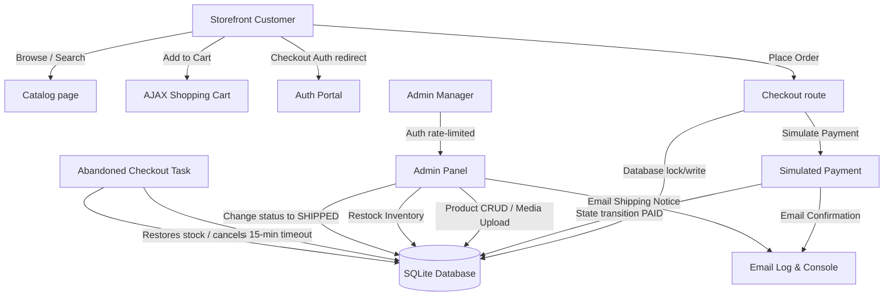
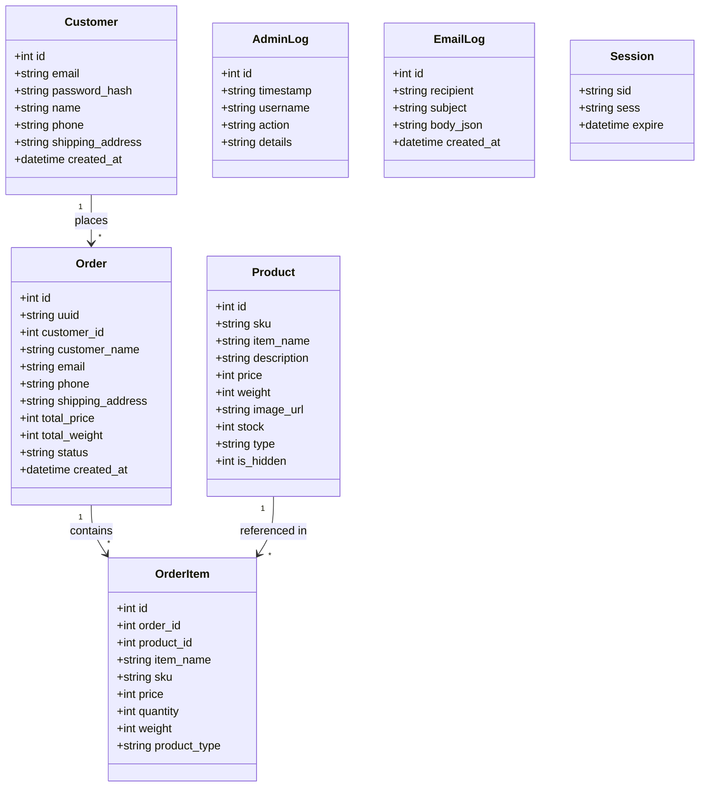

# MVP Shopify & Company Portfolio

A secure, high-performance, and responsive Node.js e-commerce storefront and admin CRUD dashboard built with Express, EJS templates, and a transactional SQLite database.

This project covers storefront browse-to-checkout workflows, customer authentication, AJAX shopping carts, inventory control warnings, email notifications, downloadable PDF invoices, and automated checkout timeout stock-restoration.

---

## ?? Table of Contents
1. [Architecture & System Design](#-architecture--system-design)
2. [Data Flow Diagram (DFD)](#-data-flow-diagram-dfd)
3. [Database & Class Diagram](#-database--class-diagram)
4. [Project Directory Structure](#-project-directory-structure)
5. [Setup & Local Installation](#-setup--local-installation)
6. [Security & Mitigations](#-security--mitigations)
7. [Vercel Deployment Guide](#-vercel-deployment-guide)

---

## ??? Architecture & System Design

The application is structured around a classic Model-View-Controller (MVC) pattern utilizing server-side rendering:
*   **Routing Engine:** Express routers decouple storefront, customer authentication, admin actions, and invoice operations.
*   **View Layer:** Dynamic EJS view templates styled with responsive vanilla CSS.
*   **Database & Operations:** SQLite database managed via `better-sqlite3` utilizing synchronous write transactions (`IMMEDIATE`) to guarantee atomic stock decrements.
*   **Background Jobs:** Automated cleanup schedulers run in the background to handle stock recovery.

---

## ?? Data Flow Diagram (DFD)

The following Mermaid diagram maps the data flows between customer actions, administrator dashboard updates, the automated checkout cleaner, the SQLite database, and transaction email logs.



---

## ??? Database & Class Diagram

The SQLite database holds tables mapping products, customer profiles, order invoices, snapshotted purchase details, and security auditing logs.



---

## ?? Project Directory Structure

```text
+-- api/                     # Vercel Serverless Function entry points
¦   +-- index.js             # Routes requests directly to src/app.js
+-- public/                  # Static assets
¦   +-- css/
¦   ¦   +-- styles.css       # Consolidated responsive styling stylesheet
¦   +-- uploads/             # Locally uploaded media assets
+-- src/                     # Core backend source code
¦   +-- config/
¦   ¦   +-- db-setup.js      # Table creation, seeds, schema migrations
¦   +-- middleware/
¦   ¦   +-- adminAuth.js     # Admin verification guard
¦   ¦   +-- csrf.js          # Timing-safe CSRF token checks
¦   ¦   +-- rateLimiter.js   # IP-based login brute-force blocker
¦   +-- routes/
¦   ¦   +-- adminProducts.js # Admin dashboard and quick inventory CRUD
¦   ¦   +-- adminReporting.js# Order history, status changes, and admin invoice downloads
¦   ¦   +-- cart.js          # Cart session management supporting AJAX
¦   ¦   +-- catalog.js       # Storefront browse routes and public views
¦   ¦   +-- checkout.js      # Transactional checkouts & simulated payments
¦   ¦   +-- customerAuth.js  # Storefront customer registration & logins
¦   ¦   +-- customerInvoice.js# Customer invoice PDF downloader (IDOR-safe)
¦   ¦   +-- pages.js         # Core company portfolio static pages
¦   ¦   +-- webhooks.js      # Sandbox mock hooks
¦   +-- utils/
¦   ¦   +-- abandonedCheckoutCleaner.js # Stock recovery timer interval
¦   ¦   +-- cryptoHelper.js  # Password scrypt hashing & timing-safe compares
¦   ¦   +-- emailHelper.js   # Transactional nodemailer mail logger
¦   ¦   +-- invoicePdfGenerator.js # pdfkit document builder
¦   ¦   +-- sqliteStore.js   # SQLite-backed session store subclasses
¦   +-- app.js               # Application initialization & config mountings
+-- views/                   # Dynamic EJS templates
¦   +-- admin/               # Admin CRUD & log panels
¦   +-- partials/            # Header and footer templates
¦   +-- ...                  # Customer storefront pages
+-- .env.example             # Initial configuration template
+-- package.json             # App scripts and dependency lists
+-- sprint_board.md          # Project sprint execution tracker
+-- vercel.json              # Vercel serverless routing configuration
```

---

## ?? Setup & Local Installation

### Prerequisites
*   Node.js (`v18.x` or `v20.x` recommended)
*   npm (packaged with Node.js)

### Installation
1. Clone the repository:
   ```bash
   git clone https://github.com/pukiskun/MVP-Shopify-plus-Compro.git
   cd MVP-Shopify-plus-Compro
   ```
2. Install npm dependencies:
   ```bash
   npm install
   ```
3. Set up environment configurations:
   * Copy the example configuration:
     ```bash
     cp .env.example .env
     ```
   * Open `.env` and set the initial administrator credentials:
     ```env
     PORT=3000
     SESSION_SECRET=your_development_session_secret
     ADMIN_USERNAME=admin
     ADMIN_PASSWORD=admin123
     ```
4. Start the application:
   ```bash
   npm run dev
   ```
   *Note: On boot, the server automatically migrates the plaintext `ADMIN_PASSWORD` in your `.env` file into a secure scrypt-hashed value. Verify `.env` after starting.*

---

## ?? Security & Mitigations

*   **Timing-Safe Verifications:** Password validation and CSRF token comparisons utilize constant-time comparison via Node's `timingSafeEqual` to prevent side-channel timing analysis.
*   **Brute-Force Protection:** Admin login requests are limited to 5 attempts per 15 minutes per IP address.
*   **CSRF Tokens:** All state-changing admin actions (POST forms) require token validations.
*   **IDOR Security Controls:** Customer order receipts, payment pages, and PDF downloads enforce strict session ownership checks, blocking arbitrary UUID enumerations.
*   **SQL Injection Prevention:** Parameterized bindings are used for all queries.

---

## ?? Vercel Deployment Guide

### Vercel Serverless Constraints
Vercel operates as a serverless execution environment. Under Vercel's serverless runtime:
1.  The local filesystem is **read-only** (excluding temporary writes to `/tmp`).
2.  Serverless instances are **stateless** and spin down on inactivity.

> [!WARNING]
> Because of these constraints, the default file-based SQLite database (`database.db`) **cannot be used for persistent production data on Vercel**. Any data written to SQLite will be wiped out when Vercel instances spin down.

### Deploying to Vercel
1.  **Configure Database for Production:**
    Before deploying to production, refactor the database connectors inside `src/config/db-setup.js` and route handlers to connect to a cloud database (such as PostgreSQL on Vercel Postgres, Supabase, Neon, or PlanetScale) when `process.env.NODE_ENV === 'production'`.
2.  **Deploy using CLI:**
    ```bash
    npm install -g vercel
    vercel
    ```
3.  **Configure Environment Variables:**
    Set the production `ADMIN_USERNAME`, `ADMIN_PASSWORD` (hashed), and database URL parameters directly inside your Vercel Dashboard project settings.
