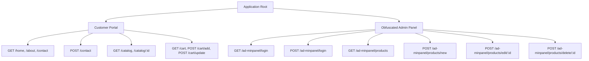

# Security Penetration Testing Schema

This document outlines the security penetration testing schema for the Company Profile & E-Commerce platform. It defines the target areas, testing methodology, payload specifications, and security validation procedures.

---

## 1. Executive Summary & Objective

The primary objective of this pentesting schema is to proactively identify, simulate, and neutralize security vulnerabilities within the application before they can be exploited. 

Given the **security-first** context of this e-commerce project, the focus is on protecting user session integrity, catalog data correctness, administrative interfaces, and third-party callback channels.

---

## 2. Target Scope Map

The pentest covers the entire application surface, mapped under two primary areas:



---

## 3. Vulnerability Target Areas & Test Scenarios

### 3.1 Cross-Site Scripting (XSS)

*   **Vulnerability Type:** Stored & Reflected XSS.
*   **Target Components:**
    *   Contact Us form (`POST /contact` - fields: `name`, `message`).
    *   Search/filter parameter queries in catalog.
    *   Admin product CRUD forms (`POST /ad-minpanel/products/new` & `POST /ad-minpanel/products/edit/:id` - fields: `item_name`, `description`).
*   **Methodology:**
    1.  Submit payloads containing executable scripts into text input areas.
    2.  Browse customer-facing viewports (Catalog list, Product Detail page, contact logs).
    3.  Inspect source HTML in browser developer tools to verify that tag brackets are escaped (e.g. `<` to `&lt;`) or sanitized, preventing execution.
*   **Testing Payloads:**
    ```html
    <script>alert('ReflectedXSS')</script>
    
    <svg onload=alert(document.cookie)>
    javascript:alert(1)
    ```

### 3.2 SQL Injection (SQLi)

*   **Vulnerability Type:** In-band (Union-based), Boolean-based, and Error-based SQLi.
*   **Target Components:**
    *   Product catalog detail endpoint (`GET /catalog/:id`).
    *   Admin edit product lookup (`GET /ad-minpanel/products/edit/:id`).
    *   Deletion parameters (`POST /ad-minpanel/products/delete/:id`).
*   **Methodology:**
    1.  Append single quotes, boolean operators, or database query breakouts to numerical route parameters.
    2.  Inspect response codes (e.g., check if a query syntax error throws raw sqlite engine stack traces or leaks database layouts).
    3.  Verify that all inputs mapped to SQLite queries strictly enforce parameterized prepared statements.
*   **Testing Payloads:**
    ```sql
    1' OR '1'='1
    1; DROP TABLE products; --
    1 UNION SELECT null, username, password FROM users --
    ' OR 1=1 --
    ```

### 3.3 Cross-Site Request Forgery (CSRF)

*   **Vulnerability Type:** Unauthorized state changes triggered via cross-origin requests.
*   **Target Components:**
    *   Product deletion (`POST /ad-minpanel/products/delete/:id`).
    *   Cart adjustments (`POST /cart/update`, `POST /cart/remove`).
*   **Methodology:**
    1.  Test if state-changing actions can be executed via GET requests (e.g. attempting to delete a product by typing `/ad-minpanel/products/delete/:id` in browser search bar).
    2.  Verify that deletion endpoints only accept `POST` requests and reject any `GET` attempts.
    3.  Ensure cookies use `SameSite=Lax` configurations to prevent cross-site request leakage.
*   **Testing Procedures:**
    *   Craft a mock external site that triggers `<a href="http://localhost:3000/ad-minpanel/products/delete/1">Click Here</a>`. Verify that clicking it does not delete product records.

### 3.4 Insecure Direct Object Reference (IDOR)

*   **Vulnerability Type:** Unauthorized resource access via parameter manipulation.
*   **Target Components:**
    *   Order Confirmation / Invoice views.
    *   Product editing endpoints (`/ad-minpanel/products/edit/:id`).
*   **Methodology:**
    1.  Sign in with two different testing accounts (e.g., Session A and Session B).
    2.  Attempt to fetch or edit resource details belonging to Session B using Session A's active cookie by changing numerical or parameter IDs.
    3.  Verify that the server cross-references resource ownership with session attributes, returning a `403 Forbidden` or `404 Not Found` for mismatched ownership.

### 3.5 Authentication & Session Bypasses

*   **Vulnerability Type:** Session Fixation, privilege escalation, and route authentication bypass.
*   **Target Components:**
    *   Admin Dashboard routing (`/ad-minpanel/*`).
    *   Session cookie store (`shopify_session`).
*   **Methodology:**
    1.  Access `/ad-minpanel/products` directly without passing the auth cookie. Verify the request redirects to `/ad-minpanel/login` or returns `403`.
    2.  **Session Fixation:** Record the session cookie value before logging in. Submit authentic login credentials. Inspect the cookie value after login. Verify that the session identifier has regenerated (is completely different) to block fixation attacks.
    3.  Check session cookie properties. Verify `httpOnly: true` is enabled, preventing script access via `document.cookie`.

---

## 4. Test Execution Lifecycle

We utilize a three-phase execution workflow for security validation:

### Phase 1: Reconnaissance & Mapping
Map active endpoints, catalog structures, query formats, and response headers. Identify all potential entry vectors.

### Phase 2: Automated Security Assertions
Run automated scripts (like our node test suite) to trigger a battery of edge-case payloads, comparing response headers and body content against expectations.

### Phase 3: Manual Penetration PoC
Use browser dev-tools or proxy interception to manually craft tampered payloads (e.g., negative prices, session token manipulation) to test edge boundary validation.

---

## 5. Standard Auditing & Verification Tools

The following tools are recommended to execute this schema:

*   **Interception Proxy:** *Burp Suite Community Edition* or *OWASP ZAP* (to inspect, capture, and manipulate headers/payloads).
*   **Vulnerability Scanners:** *sqlmap* (to audit SQLi resistance in query paths) and *XSStrike* (to analyze inputs for XSS filter bypasses).
*   **Scripting Engine:** *Node.js* with native HTTP/Fetch clients (to execute regression testing suites automatically).
*   **Browser Inspector:** Chrome/Firefox Developer Tools (to verify EJS HTML escaping, cookie properties, and response statuses).
